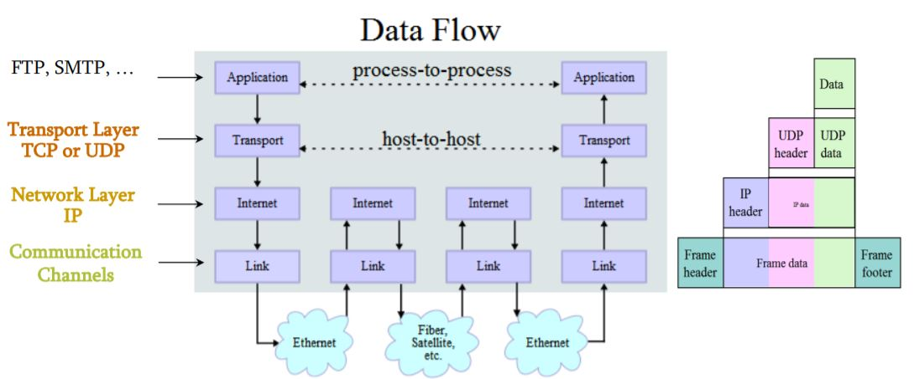
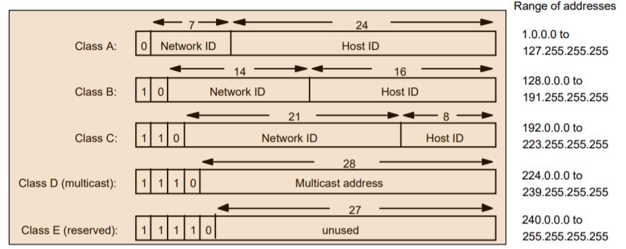
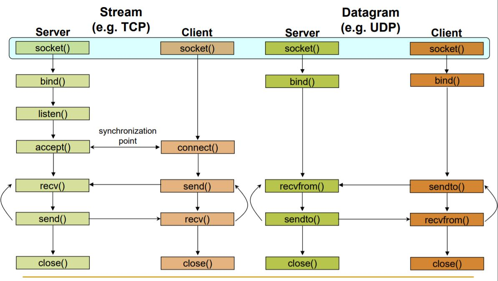

# Network Programming in C #
-----------------------------
1) Host: In which applicaiton will run 
2) Router: It will forward the packets and maintain the forward information.
3) Packets: It is sequence of bytes transmitted over the layer and contains the control informations
4) Protocol: Set of rules and framework to decide the data representation in Network. eg: HTTP TCP UDP etc

## PROTOCOL Families ##
TCP/IP provides end-to-end connectivity specify the how data should be 
  * formatted
  * addressed
  * transmitted
  * routed
  * received at the destination
```flow
+--------+    +--------+     +---------+    +--------+
| Host A | -->| Router | --->| Rounter |--->| Host B |
+--------+    +--------+     +---------+    +--------+
```



### Network Address Class Details ###



### Socket: ###
It is abstraction through which an application can send/receive data and it helps to inter-process communications. 
```
Application                           Application
Socket                                Socket
TCP                                   TCP
IP-----channel ----IP---channel-------IP
```

### There are two type of sockets 
1) TCP Plain Socket
2) UDP Socket

| Primitive | Meaning|
|-----------|--------|
| socket    |It created socket descriptor helps to communicate end to end|
| Bind      | Attach the local address to socket|
| Listen    | non-blocking call to listen to accept new connections |
| Accept    | Blocking to accept the connection |
| Connect   | Actively attempt to establish the connection|
| send      | Send the data over network |
| Receive   | Receive data from the connection |
| Close     | Release the connection |


### Client - Server Communication in UNIX ###


### Step by Step Approach to create Socket ###
##### 1) socket Creation 
```c++
int socketID = socket(PF_INET, SOCK_STREAM, 0);
/*
  Signature of Socket:
     socket(family,type,protocol);
     family: indicates the communication domain
     type: indicate the communication type SOCK_STREAM or SOCK_DGRAM
     protocol: indicate the protocol type ( IPPROTO_TCP, IPPROTO_UDP and 0 for default protocol)
     return: -1 in case of socket creation failure
 */
```

#### 2) socket Address Specification
socket API is defined in generic data type


